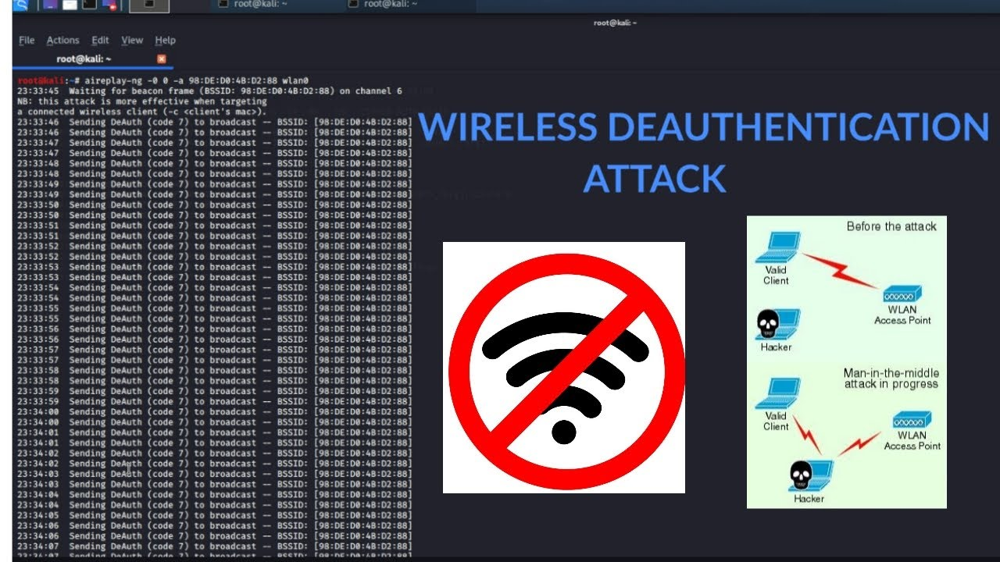

# Wi-Fi Deauthentication Attack Script

## Disclaimer
**Warning:** This script is intended for **educational purposes only**. Unauthorized use of this script against networks you do not own is **illegal** and violates ethical hacking principles. Use this responsibly and only in environments where you have explicit permission.

---

## Overview
This **Bash script** automates the process of setting up a wireless adapter in **monitor mode**, scanning for Wi-Fi networks, selecting a target, and performing a **deauthentication attack** using `aireplay-ng`.

**Features:**
- Lists available network adapters
- Configures the selected adapter into **monitor mode**
- Runs `airodump-ng` to scan networks
- Allows selection of a **target network and client**
- Performs a **deauthentication attack**
- Restores network adapter settings after execution

---

## Requirements
Ensure the following dependencies are installed on your **Kali Linux** or other penetration testing environment:

- `aircrack-ng`
- `iwconfig`
- `gnome-terminal`

To install missing packages, run:
```bash
sudo apt update && sudo apt install aircrack-ng
```

---

## Usage
### **Step 1: Run the script**
```bash
chmod +x wifideauth.sh
sudo ./wifideauth.sh
```

### **Step 2: Select Network Adapter**
The script will display available network adapters. Enter the **name of the adapter** you want to use.

### **Step 3: Start Scanning**
A **new terminal** will open with `airodump-ng`, displaying nearby Wi-Fi networks. Identify the **BSSID (MAC Address)** and **Channel** of the target network.

### **Step 4: Select Target**
- Enter the **BSSID** of the target network.
- Enter the **MAC address** of the client (or leave blank for all clients).
- Enter the **channel number** of the network.
- Enter the **number of deauthentication packets** to send.

### **Step 5: Execute the Attack**
After confirming the details, the script will:
- Set the adapter to the specified channel.
- Launch `aireplay-ng` to send **deauthentication packets** to disconnect clients.

### **Step 6: Restore Network Adapter**
Once the attack is complete, the script automatically:
- Restores the adapter to **managed mode**.
- Restarts **NetworkManager** and **wpa_supplicant** services.

---

## Image Reference


---

## Legal & Ethical Considerations
Using this script on networks without **explicit permission** is **illegal** and punishable by law. Always obtain **written consent** before testing any network.

---

## Developer
Developed by **gR00t**

For any responsible cybersecurity research inquiries, feel free to reach out!

---

